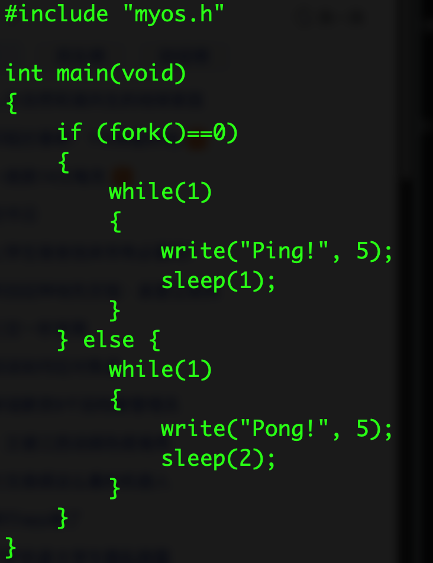
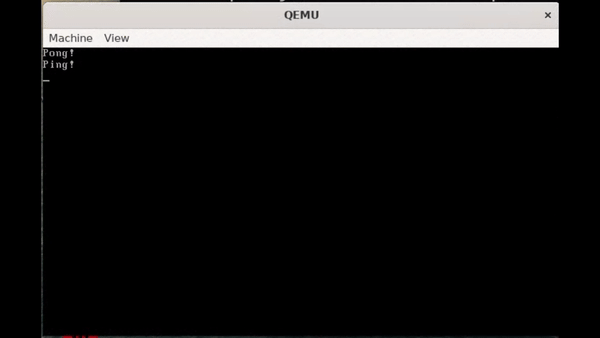

# Improved-Version-of-Simple-Syscall-Implemented-In-C-and-Assembly

Compared with Simple-Syscall-Implemented-In-C-and-Assembly, the function of fork has been implemented.

## 一、实验要求

在Simple-Syscall-Implemented-In-C-and-Assembly基础上，增加fork系统调用实现，使得支持如下示范应用运行（仅供参考）：



附加说明：

1）进程调度采用非抢占式优先级调度算法，优先级排序：用户父进程 > 用户子进程 > idle进程；

2）fork函数返回值，父进程大于0，子进程等于0

## 二、实验工具

+ 物理机操作系统：Windows 11
+ 代码编辑器：Visual Studio Code
+ Linux 环境：WSL Ubuntu20.04.6LTS
+ 虚拟机软件：QEMU (On Linux)
+ 汇编编译器：NASM 2.14.02 (On Linux)
+ C 语言编译器：GCC 9.4.0 (On Linux)

## 三、实验过程

1. 编写MBR（mbr.asm）

   由于本次实验需要实现的内核函数较多，编译后超过MBR的512字节限制，因此需要通过编写MBR来加载内核(kernel.asm)来运行。

   ```assembly
   ;mbr
   [BITS 16]
   [ORG 0x7C00]

   _start:
       MOV SP, 0x7000
       XOR AX, AX
       MOV SS, AX
       MOV ES, AX
       MOV DS, AX

       PUSHA
       MOV	AX, CS              ; 置其他段寄存器值与CS相同
       MOV	DS, AX              ; 数据段
       MOV	BP, LOAD_MSG        ; BP=当前串的偏移地址
       MOV	AX, DS              ; ES:BP = 串地址
       MOV	ES, AX              ; 置ES=DS
       MOV	CX, LOAD_MSG_LEN    ; CX = 串长
       MOV	AX, 0x1301          ; AH = 13h（功能号）、AL = 01h（光标置于串尾）
       MOV	BX, 0x0007          ; 页号为0(BH = 0) 黑底白字(BL = 07h)
       MOV DH, 0               ; 行号=0
       MOV	DL, 0               ; 列号=0
       int	0x10                ; BIOS的10h功能：显示一行字符
       POPA

   LOAD_OS_KERNEL:                            ; 加载操作系统内核
       PUSHA
       MOV AX,CS                              ; 段地址
       MOV ES,AX                              ; 设置段地址
       MOV BX, 0x8000                         ; 偏移地址
       MOV AH,2                               ; 功能号
       MOV AL,2                               ; 扇区数
       MOV DL,0x80                            ; 驱动器号
       MOV DH,0                               ; 磁头号
       MOV CH,0                               ; 柱面号
       MOV CL,2                               ; 起始扇区号
       INT 0x13
       POPA

   LOAD_PROGRAMME:                            ; 加载C程序
       PUSHA
       MOV AX,CS                              ; 段地址
       MOV ES,AX                              ; 设置段地址
       MOV BX, 0x9000                         ; 偏移地址
       MOV AH,2                               ; 功能号
       MOV AL,26                              ; 扇区数
       MOV DL,0x80                            ; 驱动器号
       MOV DH,0                               ; 磁头号
       MOV CH,0                               ; 柱面号
       MOV CL,4                               ; 起始扇区号
       INT 0x13
       POPA

   ENTER_OS:
       PUSHF
       PUSH CS
       PUSH 0x8000
       IRET                                   ; 跳转到操作系统内核执行

   AFTER:
       JMP $                                  ; 无限循环

   LOAD_MSG DB 'Bootloader is loading operating system.'
   LOAD_MSG_LEN EQU ($-LOAD_MSG)

   TIMES 510-($-$$) DB 0
   DW 0xAA55
   ```

   使用NASM编译MBR文件

   ```shell
   nasm -f bin -o mbr.bin kernel/mbr.asm
   ```
2. 编写OS内核

   1. 创建PCB进程块

      使用PCB进程块来存储进程的信息，包括进程的状态、进程的优先级、进程的栈指针等。

      尽管寄存器的值可以通过栈进行存储，但网上搜索PCB进程块的完整形式中是存储了每一个寄存器的值，因此在这里我也将每一个寄存器的值保存下来，而不是通过栈保存。

      ```assembly
      STRUC PCB
          .ID         RESB 1      ; 进程ID
          .STATE      RESB 1      ; 进程状态(0:终止, 1:准备, 2:运行, 3:睡眠)
          .PRIORITY   RESB 1      ; 进程优先级
          .CS         RESW 1      ; CS代码段寄存器
          .IP         RESW 1      ; IP指令指针
          .FLAGS      RESW 1      ; 标志寄存器
          .AX         RESW 1      ; 通用寄存器AX
          .BX         RESW 1      ; 通用寄存器BX
          .CX         RESW 1      ; 通用寄存器CX
          .DX         RESW 1      ; 通用寄存器DX
          .DI         RESW 1      ; 通用寄存器DI
          .SI         RESW 1      ; 通用寄存器SI
          .BP         RESW 1      ; 通用寄存器BP
          .SS         RESW 1      ; 堆栈段寄存器
          .SP         RESW 1      ; 堆栈指针
          .DS         RESW 1      ; 数据段寄存器
          .ES         RESW 1      ; 附加段寄存器
          .TIMER      RESW 1      ; 时钟中断计数器
          .PARENT     RESB 1      ; 父进程ID
      ENDSTRUC
      PCB_SIZE EQU 34

      CURRENT_PROCESS DW 0
      NEXT_PROCESS DW 0
      PCB_0: TIMES PCB_SIZE DB 0   ; 内核进程
      PCB_1: TIMES PCB_SIZE DB 0
      PCB_2: TIMES PCB_SIZE DB 0
      PCB_3: TIMES PCB_SIZE DB 0
      PCB_4: TIMES PCB_SIZE DB 0
      ```
   2. 进程的保存与加载

      保存进程的PCB信息，需要将栈内各个寄存器的值保存到PCB中，然后再把栈顶的IP，CS，FLAGS等信息保存到PCB中，接着保存当前进程的SP，SS等信息到PCB中，最后设置当前进程的状态为准备状态。在设置当前进程的状态时，需要判断当前进程是否处于运行状态，如果处于运行状态，则设置为准备状态，否则不设置。

      由于了解到PCB进程块中会存储各个寄存器的值，因此需要将栈中存储的寄存器值取出。

      ```assembly
      SAVE_PCB:
          POP WORD [SAVED_IP]                      ; 保存当前函数返回值IP
          ; 保存当前PCB
          MOV WORD SI,[CURRENT_PROCESS]
          POP WORD [SI+PCB.ES]
          POP WORD [SI+PCB.DS]
          POP WORD [SI+PCB.DI]
          POP WORD [SI+PCB.SI]
          POP WORD [SI+PCB.BP]
          POP WORD [SI+PCB.SP]
          POP WORD [SI+PCB.BX]
          POP WORD [SI+PCB.DX]
          POP WORD [SI+PCB.CX]
          POP WORD [SI+PCB.AX]
          POP WORD [SI+PCB.IP]                     ; 从栈顶获取当前进程IRET的IP
          POP WORD [SI+PCB.CS]                     ; 从栈顶获取当前进程IRET的CS
          POP WORD [SI+PCB.FLAGS]                  ; 从栈顶获取当前进程IRET的标志寄存器
          MOV WORD [SI+PCB.SP],SP
          MOV WORD [SI+PCB.SS],SS

          CMP BYTE [SI+PCB.STATE],2                ; 判断进程是否处于运行状态
          JNE SAVE_SKIP
          MOV BYTE [SI+PCB.STATE],1                ; 设置当前进程状态为准备
          SAVE_SKIP:
          PUSH WORD [SAVED_IP]                     ; 恢复函数返回值IP
          RET
      ```

      加载进程的PCB信息，先将当前SP，SS设置为PCB中的SP，SS，然后再将PCB中的IP，CS，FLAGS等信息加载到栈中，接着再把各个寄存器的值加载到栈中，最后设置当前进程的状态为运行状态。

      ```assembly
      LOAD_PCB:
          POP WORD [SAVED_IP]                      ; 保存当前函数返回值IP
          ; 加载下一个PCB
          MOV WORD SI,[NEXT_PROCESS]
          MOV WORD SP,[SI+PCB.SP]
          MOV WORD SS,[SI+PCB.SS]
          PUSH WORD [SI+PCB.FLAGS]
          PUSH WORD [SI+PCB.CS]
          PUSH WORD [SI+PCB.IP]
          PUSH WORD [SI+PCB.AX]
          PUSH WORD [SI+PCB.CX]
          PUSH WORD [SI+PCB.DX]
          PUSH WORD [SI+PCB.BX]
          PUSH WORD [SI+PCB.SP]
          PUSH WORD [SI+PCB.BP]
          PUSH WORD [SI+PCB.SI]
          PUSH WORD [SI+PCB.DI]
          PUSH WORD [SI+PCB.DS]
          PUSH WORD [SI+PCB.ES]

          MOV BYTE [SI+PCB.STATE],2                ; 设置下一个进程状态为运行
          MOV WORD [CURRENT_PROCESS],SI            ; 设置当前进程为下一个进程
          PUSH WORD [SAVED_IP]                     ; 恢复函数返回值IP
          RET
      ```
   3. 创建寻找最大优先级进程函数

      由于本次实验采用的是非抢占式优先级调度算法，所以需要在进程切换时，选择优先级最高的进程进行切换。因此需要编写一个函数来寻找最大优先级的进程。

      ```assembly
      FIND_PRIORITY_PROCESS:                      ; 寻找优先级最高的进程
          MOV SI, PCB_0
          MOV CL, 0
          MOV BX, 0
          FIND_PRIORITY:                          ; 遍历寻找优先级最高的进程
              CMP BYTE [SI+PCB.STATE],1           ; 进程处于准备状态
              JNE FIND_SKIP
              CMP BYTE [SI+PCB.PRIORITY],CL
              JL FIND_SKIP
              MOV WORD [NEXT_PROCESS],SI
              MOV BYTE CL,[SI+PCB.PRIORITY]
              FIND_SKIP:
              ADD SI, PCB_SIZE
              INC BX
              CMP BX,5
              JL FIND_PRIORITY
          RET
      ```
   4. 编写INT 0x80中断处理例程

      由于本次实验新添加了实现fork系统调用，所以需要在中断处理例程中添加fork系统调用的处理。

      并且，由于在父子进程切换当中涉及段寄存器的切换，所以需要在中断处理例程中恢复到初始段寄存器。

      ```assembly
      INTERUPT_HANDLER:                          ; INT 0x80中断处理
          PUSHA
          PUSH DS
          PUSH ES
          ; 恢复段寄存器
          MOV CX, CS
          MOV DS, CX
          MOV ES, CX

          CMP AX,1
          JE KERNEL_WRITE
          CMP AX,2
          JE KERNEL_SLEEP
          CMP AX,3
          JE KERNEL_FORK
      INTERUPT_END:
          POP ES
          POP DS
          POPA
          IRET
      ```
   5. 实现write系统调用

      write系统调用由于不涉及进程，因此可以沿用Simple-Syscall-Implemented-In-C-and-Assembly的代码。

      ```assembly
      KERNEL_WRITE:                              ; 内核输出字符串
          MOV SI, SP
          ADD SI, 30                             ; SI指向字符串地址
          MOV	AX, CS                             ; 置其他段寄存器值与CS相同
          MOV	DS, AX                             ; 数据段
          MOV	BP, [SI]                           ; BP=当前字符串的偏移地址
          MOV	AX, DS                             ; ES:BP = 串地址
          MOV	ES, AX                             ; ES=DS
          MOV	CX, [SI+4]                         ; CX = 字符串长度
          MOV	AX, 0x1301
          MOV	BX, 0x0007
          MOV DH,[LINE]
          MOV DL, 0x00
          INT 0x10

          MOV AL, 0x0A                           ; 换行符的ASCII码
          MOV AH, 0x0E
          INT 0x10

          INC BYTE [LINE]
          MOV AH, 0x02                           ; 功能号2表示设置光标位置
          MOV BH, 0x00                           ; 页号
          MOV DH,[LINE]
          MOV DL, 0x00                           ; 列号（0表示最左侧）
          INT 0x10

          JMP INTERUPT_END
      ```
   6. 实现sleep系统调用

      sleep系统调用首先需要将乘数50加载到CX中，然后进行乘法运算，将结果存储到AX中，然后将AX中的值存储到当前进程的计数器中，设置当前进程的状态为睡眠状态，然后调用寻找优先级最高的进程函数，最后调用进程切换函数。

      ```assembly
      KERNEL_SLEEP:                             ; 进程休眠
          CALL SAVE_PCB                         ; 保存当前进程的PCB
          MOV SI, SP
          ADD SI, 4                             ; SI指向休眠时间
          MOV AX, [SI]
          MOV CX, 50                            ; 将乘数50加载到CX中
          MUL CX                                ; 乘法运算
          MOV SI,[CURRENT_PROCESS]
          MOV WORD [SI+PCB.TIMER], AX           ; 设置计数器
          MOV BYTE [SI+PCB.STATE], 3            ; 设置进程状态为睡眠
          CALL FIND_PRIORITY_PROCESS
          CALL LOAD_PCB                         ; 加载下一个进程的PCB

          JMP INTERUPT_END
      ```
   7. 实现fork系统调用

      fork系统调用首先需要寻找空闲的进程控制块，然后复制父进程的PCB，将父进程的ID设置为子进程的父进程ID，将子进程的父进程ID设置为父进程的ID，将子进程的优先级设置为父进程的优先级-1，然后复制父进程的BX，CX，DX，DI，SI，BP，IP，CS，FLAGS等寄存器的值，最后调用寻找优先级最高的进程函数，最后加载下一个进程的PCB。

      除了复制父进程的PCB外，还需要复制父进程的堆栈段，代码段，数据段，附加段。其中，由于堆栈中只剩下API函数的返回值IP，因此没有选择 `REP MOVSB` 来复制堆栈段，而是选择手动复制堆栈段。对于代码段，数据段，附加段，通过修改段寄存器的值，然后 `REP MOVSB` 来复制，实现父子进程的代码段，数据段，附加段存在于不同的内存地址。在切换进程时，只需要修改段寄存器的值，即可实现进程的切换。

      ```assembly
      KERNEL_FORK:                                   ; 创建子进程
          CALL SAVE_PCB                              ; 保存当前进程的PCB
          CREATE_PROCESS:                            ; 寻找空闲进程控制块
              MOV SI, PCB_0
              MOV BX, 0
              FIND_VACANT_PROCESS:                   ; 遍历寻找空闲进程控制块
                  CMP BYTE [SI+PCB.STATE],0          ; 进程处于终止状态
                  JE CREATE_END
                  ADD SI, PCB_SIZE
                  INC BX
                  CMP BX,5
                  JL FIND_VACANT_PROCESS
              CREATE_END:
              MOV BYTE [SI+PCB.STATE],1              ; 设置进程状态为准备
              MOV WORD [NEXT_PROCESS],SI

          COPY_PROCESS:                              ; 复制父进程的PCB
              MOV WORD SI,[CURRENT_PROCESS]
              MOV WORD DI,[NEXT_PROCESS]
              MOV BYTE AL,[SI+PCB.ID]                ; 获取父进程的ID
              MOV BYTE [DI+PCB.PARENT],AL            ; 设置子进程的父进程ID=父进程ID
              XOR AX,AX
              MOV BYTE AL,[DI+PCB.ID]                ; 获取子进程ID
              MOV WORD [SI+PCB.AX],AX                ; 父进程ax返回值=子进程ID
              MOV BYTE AL,[SI+PCB.PRIORITY]          ; 获取父进程的优先级
              DEC AL
              MOV BYTE [DI+PCB.PRIORITY],AL          ; 设置子进程的优先级=父进程优先级-1
              MOV WORD AX,[SI+PCB.BX]                ; 复制父进程的BX
              MOV WORD [DI+PCB.BX],AX                ; 设置子进程的BX
              MOV WORD AX,[SI+PCB.CX]                ; 复制父进程的CX
              MOV WORD [DI+PCB.CX],AX                ; 设置子进程的CX
              MOV WORD AX,[SI+PCB.DX]                ; 复制父进程的DX
              MOV WORD [DI+PCB.DX],AX                ; 设置子进程的DX
              MOV WORD AX,[SI+PCB.DI]                ; 复制父进程的DI
              MOV WORD [DI+PCB.DI],AX                ; 设置子进程的DI
              MOV WORD AX,[SI+PCB.SI]                ; 复制父进程的SI
              MOV WORD [DI+PCB.SI],AX                ; 设置子进程的SI
              MOV WORD AX,[SI+PCB.BP]                ; 复制父进程的BP
              MOV WORD [DI+PCB.BP],AX                ; 设置子进程的BP
              MOV WORD AX,[SI+PCB.IP]                ; 复制父进程的IP
              MOV WORD [DI+PCB.IP],AX                ; 设置子进程的IP
              MOV WORD AX,[SI+PCB.FLAGS]             ; 复制父进程的FLAGS
              MOV WORD [DI+PCB.FLAGS],AX             ; 设置子进程的FLAGS

              ; 复制父进程的堆栈段
              POP WORD [SAVED_IP]                    ; 获取API函数返回值IP
              MOV WORD SP,[DI+PCB.SP]                ; 切换至子进程的SP
              PUSH WORD [SAVED_IP]                   ; 恢复API函数返回值IP
              MOV WORD [DI+PCB.SP],SP
              MOV WORD SP,[SI+PCB.SP]
              PUSH WORD [SAVED_IP]
              ; 复制父进程的代码段、数据段、附加段
              PUSHA
              MOV WORD AX, [SI+PCB.DS]
              MOV CX, AX
              ADD CX, 0x1000
              MOV WORD [DI+PCB.DS], CX               ; 设置子进程的DS=父进程DS+0x1000
              PUSH DS
              PUSH ES
              MOV DS, AX
              MOV SI, 0x9000
              MOV ES, CX
              MOV DI, 0x9000
              MOV CX, 0x3100                         ; 复制0x3000字节
              REP MOVSB                              ; 将DS:SI复制到ES:DI
              POP ES
              POP DS
              MOV WORD AX, [SI+PCB.CS]
              ADD AX, 0x1000
              MOV WORD [DI+PCB.CS], CX               ; 设置子进程的CS=父进程CS+0x1000
              MOV WORD AX, [SI+PCB.ES]
              ADD AX, 0x1000
              MOV WORD [DI+PCB.ES], CX               ; 设置子进程的ES=父进程ES+0x1000
              POPA

          CALL FIND_PRIORITY_PROCESS                 ; 寻找优先级最高的进程
          CALL LOAD_PCB                              ; 加载下一个进程的PCB

          JMP INTERUPT_END
      ```
   8. 编写时钟中断处理例程

      时钟中断处理例程，首先将当前进程的状态设置为准备状态，然后遍历减少睡眠进程的计数器，将计数器减1，如果计数器为0，则将进程的状态设置为准备状态，然后调用寻找优先级最高的进程函数，最后调用进程切换函数。

      ```assembly
      CLOCK_INTERRUPT:                           ; 时钟中断处理例程
          PUSHA
          PUSH DS
          PUSH ES
          CALL SAVE_PCB                          ; 保存当前进程的PCB
          DECREASE_TIMER:                        ; 减少睡眠进程的计数器
              MOV SI, PCB_0
              MOV BX, 0
              DECREASE_LOOP:                     ; 遍历减少睡眠进程的计数器
                  CMP BYTE [SI+PCB.STATE],3      ; 进程处于睡眠状态
                  JNE DECREACE_SKIP
                  DEC WORD [SI+PCB.TIMER]
                  CMP WORD [SI+PCB.TIMER],0      ; 计数器为0则转为准备状态
                  JNE DECREACE_SKIP
                  MOV BYTE [SI+PCB.STATE],1
                  DECREACE_SKIP:
                  ADD SI, PCB_SIZE
                  INC BX
                  CMP BX,5
                  JL DECREASE_LOOP
          CALL FIND_PRIORITY_PROCESS             ; 寻找优先级最高的进程
          CALL LOAD_PCB                          ; 加载下一个进程的PCB
          MOV AL, 0x20
          OUT 0x20, AL                           ; 发送EOI命令给8259A中断控制器
          JMP INTERUPT_END
      ```
   9. 使用NASM编译内核文件

   ```shell
   nasm -f bin -o kernel.bin kernel/kernel.asm
   ```
3. 编写API

   1. 编写C语言库函数

      ```c
      /* myos.h */
      #ifndef myos_h
      #define myos_h

      extern void write(const char* str,short len);
      extern void sleep(short sec);
      extern short fork();

      #endif
      ```
   2. 使用汇编实现myos.h中的函数

      其中由于fork函数需要返回值，且会返回两次，因此所以需要在fork函数中保存栈中RET所需的IP返回值，然后调用fork系统调用，最后恢复栈中RET所需的IP返回值。

      ```assembly
      write:
          MOV AX,1
          INT 0x80
          RET

      sleep:
          MOV AX,2
          INT 0x80
          RET

      fork:
          MOV AX,3
          INT 0x80
          RET
      ```
4. 编写用户程序

   ```c
   #include"myos.h"
   int t=1;
   int main(void){
       if(fork() == 0){
           t=1;
           while(1){
               write("Ping!",5);
               sleep(t);
           }
       }
       else{
           t=2;
           while(1){
               write("Pong!",5);
               sleep(t);
           }
       }
   }
   ```
5. 使用GCC和NASM混合编译，并使用objcopy提取数据段和代码段

   ```shell
   nasm -f elf32 ./api/api.asm -o api.o
   gcc -march=i386 -m16 -I ./api -c ./app/demo.c -o demo.o 
   gcc -Wall -nostdlib -m16 -o os.o demo.o api.o
   objcopy -O binary -j .text -j .data -j .rodata os.o os.bin
   ```
6. 创建虚拟磁盘并将MBR，内核，用户程序写入虚拟磁盘

   ```shell
   qemu-img create -f raw disk.img 1M
   dd if=mbr.bin of=disk.img bs=512 count=1 conv=notrunc 2>/dev/null
   dd if=kernel.bin of=disk.img bs=512 seek=1 count=2 conv=notrunc 2>/dev/null
   dd if=os.bin of=disk.img bs=512 seek=3 count=10 conv=notrunc 2>/dev/null
   ```
7. 使用QEMU运行虚拟磁盘

   ```shell
    qemu-system-x86_64 -smp sockets=1,cores=1,threads=2 -m 2048 -drive file=disk.img
   ```
8. 编写Makefile文件

   ```makefile
   KERNEL_DIR = kernel
   API_DIR = api
   APP_DIR = app

   QEMU_IMG = qemu-img
   NASM_BIN = nasm
   NASM_BIN_FLAGS = -f bin
   NASM_ELF32_FLAGS = -f elf32
   GCC = gcc
   GCC_ARCH = -march=i386
   GCC_BITS = -m16
   GCC_INCLUDE = -I $(API_DIR)
   GCC_WALL = -Wall
   GCC_NOSTDLIB = -nostdlib
   OBJCOPY = objcopy
   OBJCOPY_FLAGS = -O binary -j .text -j .data -j .rodata
   DD = dd
   DD_BS = bs=512
   DD_CONV = conv=notrunc 2>/dev/null
   QEMU = qemu-system-x86_64
   QEMU_FLAGS = -smp sockets=1,cores=1,threads=2 -m 2048

   all: run

   clean:
   	rm -f *.o *.bin *.img

   disk.img:
   	$(QEMU_IMG) create -f raw disk.img 1M

   mbr.bin: $(KERNEL_DIR)/mbr.asm
   	$(NASM_BIN) $(NASM_BIN_FLAGS) -o mbr.bin $<

   kernel.bin: $(KERNEL_DIR)/kernel.asm
   	$(NASM_BIN) $(NASM_BIN_FLAGS) -o kernel.bin $<

   api.o: $(API_DIR)/api.asm
   	$(NASM_BIN) $(NASM_ELF32_FLAGS) $< -o api.o

   demo.o: $(APP_DIR)/demo.c
   	$(GCC) $(GCC_ARCH) $(GCC_BITS) $(GCC_INCLUDE) -c $< -o demo.o

   os.o: demo.o api.o
   	$(GCC) $(GCC_WALL) $(GCC_NOSTDLIB) $(GCC_BITS) -o os.o demo.o api.o

   os.bin: os.o
   	$(OBJCOPY) $(OBJCOPY_FLAGS) os.o os.bin

   disk.img: mbr.bin kernel.bin os.bin
   	$(DD) if=mbr.bin of=disk.img $(DD_BS) count=1 $(DD_CONV)
   	$(DD) if=kernel.bin of=disk.img $(DD_BS) seek=1 count=2 $(DD_CONV)
   	$(DD) if=os.bin of=disk.img $(DD_BS) seek=3 count=26 $(DD_CONV)

   run: disk.img
   	$(QEMU) $(QEMU_FLAGS) -drive file=disk.img

   .PHONY: all clean run

   ```

## 四、实验结果

运行后，首先会先进行清屏操作，然后在屏幕上会间隔1s输出“Ping!”,间隔2s输出“Pong!”，且由于采用了非抢占式优先级调度算法，所以在会先输出“Pong!”再输出“Ping!”。

具体效果在gif文件有呈现



## 五、总结与思考

+ 本次实验在PA4的基础上增加了fork系统调用，使得支持了进程的创建，通过fork系统调用可以创建一个子进程，子进程与父进程共享代码段，数据段，堆栈段等，但是子进程会复制父进程的PCB，然后将子进程的ID设置为父进程的子进程ID，子进程的优先级设置为父进程的优先级-1，最后同时将父子进程的状态设置为准备状态，然后调用寻找优先级最高的进程函数，最后调用进程切换函数。
+ 为了实现PCB进程块，需要在PCB进程块中存储进程的ID，状态，优先级，CS，IP，FLAGS，AX，BX，CX，DX，DI，SI，BP，SS，SP，DS，ES，TIMER，PARENT等信息，然后在保存进程的PCB信息时，需要将栈内各个寄存器的值保存到PCB中，然后再把栈顶的IP，CS，FLAGS等信息保存到PCB中，接着保存当前进程的SP，SS等信息到PCB中，最后设置当前进程的状态为准备状态。没有选择通过栈来保存寄存器的值，而是通过PCB进程块来保存寄存器的值，一方面是为了更好的复原PCB进程块的真实结构，另一方面是因为这样设置PCB进程块可以较为方便的对寄存器的值进行获取或更改。
+ 在实现进程切换函数时，需要将设置CURRENT_PROCESS和NEXT_PROCESS的状态，将NEXT_PROCESS的状态设置为运行状态，而对于CURRENT_PROCESS需要注意判断当前进程是否处于睡眠状态，如果处于睡眠状态，则无需将其状态设置为准备状态，否则会使睡眠进程被调度。
+ 在实现fork系统调用时，由于fork函数需要返回值，且会返回两次，一开始我直接使用PUSH和POP来保存BX，CX，DX等寄存器的值，但是发现在调用fork系统调用后，仅有父进程可以正常运行，子进程无法正常运行。后来我发现是因为在调用fork系统调用后，子进程的栈内仅存有INT 0x80的返回地址，而没有保存BX，CX，DX等寄存器的值，导致子进程无法正常运行。最后选择设置外部变量来保存BX，CX，DX等寄存器的值，然后在调用fork系统调用后，再恢复BX，CX，DX等寄存器的值，最后子进程可以正常运行。
+ 为了能够实现父子进程的代码段，数据段，堆栈段等存在于不同的内存地址，需要在fork系统调用中复制父进程，由于数据段难以定位具体位置，因此采用整体复制堆栈段，代码段，数据段，附加段等，通过修改段寄存器的值，然后 `REP MOVSB` 来复制，实现父子进程的代码段，数据段，附加段存在于不同的内存地址。在切换进程时，只需要修改段寄存器的值，即可实现进程的切换。

## 六、完整代码及注释

mbr.asm

```assembly
;mbr
[BITS 16]
[ORG 0x7C00]

_start:
    MOV SP, 0x7000
    XOR AX, AX
    MOV SS, AX
    MOV ES, AX
    MOV DS, AX

    PUSHA
    MOV	AX, CS              ; 置其他段寄存器值与CS相同
    MOV	DS, AX              ; 数据段
    MOV	BP, LOAD_MSG        ; BP=当前串的偏移地址
    MOV	AX, DS              ; ES:BP = 串地址
    MOV	ES, AX              ; 置ES=DS
    MOV	CX, LOAD_MSG_LEN    ; CX = 串长
    MOV	AX, 0x1301          ; AH = 13h（功能号）、AL = 01h（光标置于串尾）
    MOV	BX, 0x0007          ; 页号为0(BH = 0) 黑底白字(BL = 07h)
    MOV DH, 0               ; 行号=0
    MOV	DL, 0               ; 列号=0
    int	0x10                ; BIOS的10h功能：显示一行字符
    POPA

LOAD_OS_KERNEL:                            ; 加载操作系统内核
    PUSHA
    MOV AX,CS                              ; 段地址
    MOV ES,AX                              ; 设置段地址
    MOV BX, 0x8000                         ; 偏移地址
    MOV AH,2                               ; 功能号
    MOV AL,2                               ; 扇区数
    MOV DL,0x80                            ; 驱动器号
    MOV DH,0                               ; 磁头号
    MOV CH,0                               ; 柱面号
    MOV CL,2                               ; 起始扇区号
    INT 0x13
    POPA

LOAD_PROGRAMME:                            ; 加载C程序
    PUSHA
    MOV AX,CS                              ; 段地址
    MOV ES,AX                              ; 设置段地址
    MOV BX, 0x9000                         ; 偏移地址
    MOV AH,2                               ; 功能号
    MOV AL,26                              ; 扇区数
    MOV DL,0x80                            ; 驱动器号
    MOV DH,0                               ; 磁头号
    MOV CH,0                               ; 柱面号
    MOV CL,4                               ; 起始扇区号
    INT 0x13
    POPA

ENTER_OS:
    PUSHF
    PUSH CS
    PUSH 0x8000
    IRET                                   ; 跳转到操作系统内核执行

AFTER:
    JMP $                                  ; 无限循环

LOAD_MSG DB 'Bootloader is loading operating system.'
LOAD_MSG_LEN EQU ($-LOAD_MSG)

TIMES 510-($-$$) DB 0
DW 0xAA55
```

kernel.asm

```assembly
;kernel
[BITS 16]
[ORG 0x8000]

_start:
    ;PCB初始化
    MOV BYTE [PCB_0+PCB.STATE], 2
    MOV WORD [PCB_0+PCB.SP], 0x7000
    MOV BYTE [PCB_1+PCB.ID], 1
    MOV WORD [PCB_1+PCB.SP], 0x6000
    MOV BYTE [PCB_2+PCB.ID], 2
    MOV WORD [PCB_2+PCB.SP], 0x5000
    MOV BYTE [PCB_3+PCB.ID], 3
    MOV WORD [PCB_3+PCB.SP], 0x4000
    MOV BYTE [PCB_4+PCB.ID], 4
    MOV WORD [PCB_4+PCB.SP], 0x3000

    MOV AX, 0x0003
    INT 0x10                               ; 清屏

    CALL SET_INTERRUPT                     ; 设置中断向量表
    CALL SET_TIMER                         ; 设置定时器

    ; 模仿硬件中断，先将后续执行代码的CS:IP以及标志寄存器（PSW）的值保存到栈上
    PUSHF
    PUSH CS
    PUSH KERNEL_LOOP
    PUSHA
    PUSH DS
    PUSH ES

    MOV WORD [CURRENT_PROCESS],PCB_0
    MOV WORD [NEXT_PROCESS],PCB_1
    MOV BYTE [PCB_0+PCB.PRIORITY],1
    MOV BYTE [PCB_1+PCB.PRIORITY],5

    CALL SAVE_PCB                         ; 保存当前进程的PCB
    CALL LOAD_PCB                         ; 加载下一个进程的PCB

    PUSHF
    PUSH CS
    PUSH 0x9000
    IRET                                  ; 跳转到C程序执行

KERNEL_LOOP:
    JMP KERNEL_LOOP                        ; 无限循环
  
SET_INTERRUPT:
    MOV AX, 0      
    MOV ES, AX
    MOV WORD [ES:4*0x08], CLOCK_INTERRUPT  ; 将时钟中断处理例程写入中断向量表
    MOV WORD [ES:4*0x08+2], CS
    MOV WORD [ES:4*0x80], INTERUPT_HANDLER ; 将INT 0x80中断处理例程写入中断向量表
    MOV WORD [ES:4*0x80+2], CS
    RET

SET_TIMER:                                 ; 设置8253/4定时器芯片
    MOV AL, 0x36 
    OUT 0x43, AL
    MOV AX, 0x5D37                         ; 每隔20ms产生一次时钟中断
    OUT 0x40, AL
    MOV AL, AH
    OUT 0x40, AL
    RET

FIND_PRIORITY_PROCESS:                      ; 寻找优先级最高的进程
    MOV SI, PCB_0
    MOV CL, 0
    MOV BX, 0
    FIND_PRIORITY:                          ; 遍历寻找优先级最高的进程
        CMP BYTE [SI+PCB.STATE],1           ; 进程处于准备状态
        JNE FIND_SKIP
        CMP BYTE [SI+PCB.PRIORITY],CL
        JL FIND_SKIP
        MOV WORD [NEXT_PROCESS],SI
        MOV BYTE CL,[SI+PCB.PRIORITY]
        FIND_SKIP:
        ADD SI, PCB_SIZE
        INC BX
        CMP BX,5
        JL FIND_PRIORITY
    RET

SAVE_PCB:
    POP WORD [SAVED_IP]                      ; 保存当前函数返回值IP
    ; 保存当前PCB
    MOV WORD SI,[CURRENT_PROCESS]
    POP WORD [SI+PCB.ES]
    POP WORD [SI+PCB.DS]
    POP WORD [SI+PCB.DI]
    POP WORD [SI+PCB.SI]
    POP WORD [SI+PCB.BP]
    POP WORD [SI+PCB.SP]
    POP WORD [SI+PCB.BX]
    POP WORD [SI+PCB.DX]
    POP WORD [SI+PCB.CX]
    POP WORD [SI+PCB.AX]
    POP WORD [SI+PCB.IP]                     ; 从栈顶获取当前进程IRET的IP
    POP WORD [SI+PCB.CS]                     ; 从栈顶获取当前进程IRET的CS
    POP WORD [SI+PCB.FLAGS]                  ; 从栈顶获取当前进程IRET的标志寄存器
    MOV WORD [SI+PCB.SP],SP
    MOV WORD [SI+PCB.SS],SS

    CMP BYTE [SI+PCB.STATE],2                ; 判断进程是否处于运行状态
    JNE SAVE_SKIP
    MOV BYTE [SI+PCB.STATE],1                ; 设置当前进程状态为准备
    SAVE_SKIP:
    PUSH WORD [SAVED_IP]                     ; 恢复函数返回值IP
    RET

LOAD_PCB:
    POP WORD [SAVED_IP]                      ; 保存当前函数返回值IP
    ; 加载下一个PCB
    MOV WORD SI,[NEXT_PROCESS]
    MOV WORD SP,[SI+PCB.SP]
    MOV WORD SS,[SI+PCB.SS]
    PUSH WORD [SI+PCB.FLAGS]
    PUSH WORD [SI+PCB.CS]
    PUSH WORD [SI+PCB.IP]
    PUSH WORD [SI+PCB.AX]
    PUSH WORD [SI+PCB.CX]
    PUSH WORD [SI+PCB.DX]
    PUSH WORD [SI+PCB.BX]
    PUSH WORD [SI+PCB.SP]
    PUSH WORD [SI+PCB.BP]
    PUSH WORD [SI+PCB.SI]
    PUSH WORD [SI+PCB.DI]
    PUSH WORD [SI+PCB.DS]
    PUSH WORD [SI+PCB.ES]

    MOV BYTE [SI+PCB.STATE],2                ; 设置下一个进程状态为运行
    MOV WORD [CURRENT_PROCESS],SI            ; 设置当前进程为下一个进程
    PUSH WORD [SAVED_IP]                     ; 恢复函数返回值IP
    RET

CLOCK_INTERRUPT:                           ; 时钟中断处理例程
    PUSHA
    PUSH DS
    PUSH ES
    CALL SAVE_PCB                          ; 保存当前进程的PCB
    DECREASE_TIMER:                        ; 减少睡眠进程的计数器
        MOV SI, PCB_0
        MOV BX, 0
        DECREASE_LOOP:                     ; 遍历减少睡眠进程的计数器
            CMP BYTE [SI+PCB.STATE],3      ; 进程处于睡眠状态
            JNE DECREACE_SKIP
            DEC WORD [SI+PCB.TIMER]
            CMP WORD [SI+PCB.TIMER],0      ; 计数器为0则转为准备状态
            JNE DECREACE_SKIP
            MOV BYTE [SI+PCB.STATE],1
            DECREACE_SKIP:
            ADD SI, PCB_SIZE
            INC BX
            CMP BX,5
            JL DECREASE_LOOP
    CALL FIND_PRIORITY_PROCESS             ; 寻找优先级最高的进程
    CALL LOAD_PCB                          ; 加载下一个进程的PCB
    MOV AL, 0x20
    OUT 0x20, AL                           ; 发送EOI命令给8259A中断控制器
    JMP INTERUPT_END

INTERUPT_HANDLER:                          ; INT 0x80中断处理
    PUSHA
    PUSH DS
    PUSH ES
    ; 恢复段寄存器
    MOV CX, CS
    MOV DS, CX
    MOV ES, CX

    CMP AX,1
    JE KERNEL_WRITE
    CMP AX,2
    JE KERNEL_SLEEP
    CMP AX,3
    JE KERNEL_FORK
INTERUPT_END:
    POP ES
    POP DS
    POPA
    IRET

KERNEL_WRITE:                              ; 内核输出字符串
    MOV SI, SP
    ADD SI, 30                             ; SI指向字符串地址
    MOV	AX, CS                             ; 置其他段寄存器值与CS相同
    MOV	DS, AX                             ; 数据段
    MOV	BP, [SI]                           ; BP=当前字符串的偏移地址
    MOV	AX, DS                             ; ES:BP = 串地址
    MOV	ES, AX                             ; ES=DS
    MOV	CX, [SI+4]                         ; CX = 字符串长度
    MOV	AX, 0x1301
    MOV	BX, 0x0007
    MOV DH,[LINE]
    MOV DL, 0x00
    INT 0x10

    MOV AL, 0x0A                           ; 换行符的ASCII码
    MOV AH, 0x0E
    INT 0x10

    INC BYTE [LINE]
    MOV AH, 0x02                           ; 功能号2表示设置光标位置
    MOV BH, 0x00                           ; 页号
    MOV DH,[LINE]
    MOV DL, 0x00                           ; 列号（0表示最左侧）
    INT 0x10

    JMP INTERUPT_END

KERNEL_SLEEP:                             ; 进程休眠
    CALL SAVE_PCB                         ; 保存当前进程的PCB
    MOV SI, SP
    ADD SI, 4                             ; SI指向休眠时间
    MOV AX, [SI]
    MOV CX, 50                            ; 将乘数50加载到CX中
    MUL CX                                ; 乘法运算
    MOV SI,[CURRENT_PROCESS]
    MOV WORD [SI+PCB.TIMER], AX           ; 设置计数器
    MOV BYTE [SI+PCB.STATE], 3            ; 设置进程状态为睡眠
    CALL FIND_PRIORITY_PROCESS
    CALL LOAD_PCB                         ; 加载下一个进程的PCB
  
    JMP INTERUPT_END

KERNEL_FORK:                                   ; 创建子进程
    CALL SAVE_PCB                              ; 保存当前进程的PCB
    CREATE_PROCESS:                            ; 寻找空闲进程控制块
        MOV SI, PCB_0
        MOV BX, 0
        FIND_VACANT_PROCESS:                   ; 遍历寻找空闲进程控制块
            CMP BYTE [SI+PCB.STATE],0          ; 进程处于终止状态
            JE CREATE_END
            ADD SI, PCB_SIZE
            INC BX
            CMP BX,5
            JL FIND_VACANT_PROCESS
        CREATE_END:
        MOV BYTE [SI+PCB.STATE],1              ; 设置进程状态为准备
        MOV WORD [NEXT_PROCESS],SI

    COPY_PROCESS:                              ; 复制父进程的PCB
        MOV WORD SI,[CURRENT_PROCESS]
        MOV WORD DI,[NEXT_PROCESS]
        MOV BYTE AL,[SI+PCB.ID]                ; 获取父进程的ID
        MOV BYTE [DI+PCB.PARENT],AL            ; 设置子进程的父进程ID=父进程ID
        XOR AX,AX
        MOV BYTE AL,[DI+PCB.ID]                ; 获取子进程ID
        MOV WORD [SI+PCB.AX],AX                ; 父进程ax返回值=子进程ID
        MOV BYTE AL,[SI+PCB.PRIORITY]          ; 获取父进程的优先级
        DEC AL
        MOV BYTE [DI+PCB.PRIORITY],AL          ; 设置子进程的优先级=父进程优先级-1
        MOV WORD AX,[SI+PCB.BX]                ; 复制父进程的BX
        MOV WORD [DI+PCB.BX],AX                ; 设置子进程的BX
        MOV WORD AX,[SI+PCB.CX]                ; 复制父进程的CX
        MOV WORD [DI+PCB.CX],AX                ; 设置子进程的CX
        MOV WORD AX,[SI+PCB.DX]                ; 复制父进程的DX
        MOV WORD [DI+PCB.DX],AX                ; 设置子进程的DX
        MOV WORD AX,[SI+PCB.DI]                ; 复制父进程的DI
        MOV WORD [DI+PCB.DI],AX                ; 设置子进程的DI
        MOV WORD AX,[SI+PCB.SI]                ; 复制父进程的SI
        MOV WORD [DI+PCB.SI],AX                ; 设置子进程的SI
        MOV WORD AX,[SI+PCB.BP]                ; 复制父进程的BP
        MOV WORD [DI+PCB.BP],AX                ; 设置子进程的BP
        MOV WORD AX,[SI+PCB.IP]                ; 复制父进程的IP
        MOV WORD [DI+PCB.IP],AX                ; 设置子进程的IP
        MOV WORD AX,[SI+PCB.FLAGS]             ; 复制父进程的FLAGS
        MOV WORD [DI+PCB.FLAGS],AX             ; 设置子进程的FLAGS

        ; 复制父进程的堆栈段
        POP WORD [SAVED_IP]                    ; 获取API函数返回值IP
        MOV WORD SP,[DI+PCB.SP]                ; 切换至子进程的SP
        PUSH WORD [SAVED_IP]                   ; 恢复API函数返回值IP
        MOV WORD [DI+PCB.SP],SP
        MOV WORD SP,[SI+PCB.SP]
        PUSH WORD [SAVED_IP]
        ; 复制父进程的代码段、数据段、附加段
        PUSHA
        MOV WORD AX, [SI+PCB.DS]
        MOV CX, AX
        ADD CX, 0x1000
        MOV WORD [DI+PCB.DS], CX               ; 设置子进程的DS=父进程DS+0x1000
        PUSH DS
        PUSH ES
        MOV DS, AX
        MOV SI, 0x9000
        MOV ES, CX
        MOV DI, 0x9000
        MOV CX, 0x3100                         ; 复制0x3000字节
        REP MOVSB                              ; 将DS:SI复制到ES:DI
        POP ES
        POP DS
        MOV WORD AX, [SI+PCB.CS]
        ADD AX, 0x1000
        MOV WORD [DI+PCB.CS], CX               ; 设置子进程的CS=父进程CS+0x1000
        MOV WORD AX, [SI+PCB.ES]
        ADD AX, 0x1000
        MOV WORD [DI+PCB.ES], CX               ; 设置子进程的ES=父进程ES+0x1000
        POPA

    CALL FIND_PRIORITY_PROCESS                 ; 寻找优先级最高的进程
    CALL LOAD_PCB                              ; 加载下一个进程的PCB
  
    JMP INTERUPT_END

LINE DB 0                                  ; 存储当前输出的行数
SAVED_IP DD 0

STRUC PCB
    .ID         RESB 1      ; 进程ID
    .STATE      RESB 1      ; 进程状态(0:终止, 1:准备, 2:运行, 3:睡眠)
    .PRIORITY   RESB 1      ; 进程优先级
    .CS         RESW 1      ; CS代码段寄存器
    .IP         RESW 1      ; IP指令指针
    .FLAGS      RESW 1      ; 标志寄存器
    .AX         RESW 1      ; 通用寄存器AX
    .BX         RESW 1      ; 通用寄存器BX
    .CX         RESW 1      ; 通用寄存器CX
    .DX         RESW 1      ; 通用寄存器DX
    .DI         RESW 1      ; 通用寄存器DI
    .SI         RESW 1      ; 通用寄存器SI
    .BP         RESW 1      ; 通用寄存器BP
    .SS         RESW 1      ; 堆栈段寄存器
    .SP         RESW 1      ; 堆栈指针
    .DS         RESW 1      ; 数据段寄存器
    .ES         RESW 1      ; 附加段寄存器
    .TIMER      RESW 1      ; 时钟中断计数器
    .PARENT     RESB 1      ; 父进程ID
ENDSTRUC
PCB_SIZE EQU 34

CURRENT_PROCESS DW 0
NEXT_PROCESS DW 0
PCB_0: TIMES PCB_SIZE DB 0   ; 内核进程
PCB_1: TIMES PCB_SIZE DB 0
PCB_2: TIMES PCB_SIZE DB 0
PCB_3: TIMES PCB_SIZE DB 0
PCB_4: TIMES PCB_SIZE DB 0


TIMES 1024-($-$$) DB 0
```

api.asm

```assembly
; C库函数
[BITS 16]
[global write]
[global sleep]
[global fork]

write:
    MOV AX,1
    INT 0x80
    RET

sleep:
    MOV AX,2
    INT 0x80
    RET

fork:
    MOV AX,3
    INT 0x80
    RET
```

myos.h

```c
/* myos.h */
#ifndef myos_h
#define myos_h

extern void write(const char* str,short len);
extern void sleep(short sec);
extern short fork();

#endif
```

demo.c

```c
#include"myos.h"
int t=1;
int main(void){
    if(fork() == 0){
        t=1;
        while(1){
            write("Ping!",5);
            sleep(t);
        }
    }
    else{
        t=2;
        while(1){
            write("Pong!",5);
            sleep(t);
        }
    }
}
```

Makefile

```makefile
KERNEL_DIR = kernel
API_DIR = api
APP_DIR = app

QEMU_IMG = qemu-img
NASM_BIN = nasm
NASM_BIN_FLAGS = -f bin
NASM_ELF32_FLAGS = -f elf32
GCC = gcc
GCC_ARCH = -march=i386
GCC_BITS = -m16
GCC_INCLUDE = -I $(API_DIR)
GCC_WALL = -Wall
GCC_NOSTDLIB = -nostdlib
OBJCOPY = objcopy
OBJCOPY_FLAGS = -O binary -j .text -j .data -j .rodata
DD = dd
DD_BS = bs=512
DD_CONV = conv=notrunc 2>/dev/null
QEMU = qemu-system-x86_64
QEMU_FLAGS = -smp sockets=1,cores=1,threads=2 -m 2048

all: run

clean:
	rm -f *.o *.bin *.img

disk.img:
	$(QEMU_IMG) create -f raw disk.img 1M

mbr.bin: $(KERNEL_DIR)/mbr.asm
	$(NASM_BIN) $(NASM_BIN_FLAGS) -o mbr.bin $<

kernel.bin: $(KERNEL_DIR)/kernel.asm
	$(NASM_BIN) $(NASM_BIN_FLAGS) -o kernel.bin $<

api.o: $(API_DIR)/api.asm
	$(NASM_BIN) $(NASM_ELF32_FLAGS) $< -o api.o

demo.o: $(APP_DIR)/demo.c
	$(GCC) $(GCC_ARCH) $(GCC_BITS) $(GCC_INCLUDE) -c $< -o demo.o

os.o: demo.o api.o
	$(GCC) $(GCC_WALL) $(GCC_NOSTDLIB) $(GCC_BITS) -o os.o demo.o api.o

os.bin: os.o
	$(OBJCOPY) $(OBJCOPY_FLAGS) os.o os.bin

disk.img: mbr.bin kernel.bin os.bin
	$(DD) if=mbr.bin of=disk.img $(DD_BS) count=1 $(DD_CONV)
	$(DD) if=kernel.bin of=disk.img $(DD_BS) seek=1 count=2 $(DD_CONV)
	$(DD) if=os.bin of=disk.img $(DD_BS) seek=3 count=26 $(DD_CONV)

run: disk.img
	$(QEMU) $(QEMU_FLAGS) -drive file=disk.img

.PHONY: all clean run
```
